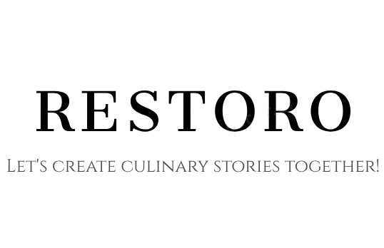

# Restoro - Система управления заказами в ресторане


**Restoro** — это система управления заказами в ресторане, разработанная для упрощения и автоматизации процессов, таких как обработка заказов, управление столами, меню и бронирования. Цель проекта — предоставить удобный инструмент для администраторов, сотрудников и клиентов ресторана.



## Основные функции проекта:

- 🔧 Управление клиентскими заказами с учетом персонализированных предпочтений.
- 🍽️ Создание и редактирование меню, включая управление ингредиентами.
- 📍 Система бронирования столиков с отображением доступности в реальном времени.
- 🔐 Роли пользователей (администратор, сотрудник, клиент) с соответствующими правами доступа.
- 🔫 Интеграция с базой данных SQLite для хранения информации о заказах, столах, клиентах и сотрудниках.

## Установка

### Требования
- Python 3.7 или выше
- Установленный PIP для управления зависимостями

### Шаги установки

1. **Клонирование репозитория**
   ```bash
   git clone https://github.com/Klimin0Andrey/Restoran.git
   ```

2. **Переход в директорию проекта**
   ```bash
   cd Restoran
   ```

3. **Создание виртуального окружения**
   ```bash
   python3 -m venv venv
   ```

4. **Активация виртуального окружения**
   - Linux/MacOS:
     ```bash
     source venv/bin/activate
     ```
   - Windows:
     ```bash
     .\venv\Scripts\activate
     ```

5. **Установка зависимостей**
   ```bash
   pip install -r requirements.txt
   ```

6. **Запуск проекта**
   ```bash
   python3 authorization.py
   ```

## Документация
Полная пользовательская документация доступна по [этой ссылке](./docs/Курсовой проект. Система управления заказами в ресторане Климин 316ИС-22.docx).


**Restoro** — ваш надежный инструмент для оптимизации работы ресторана!

